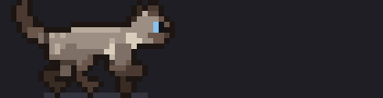
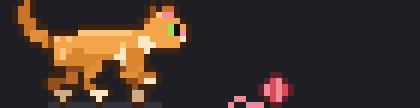
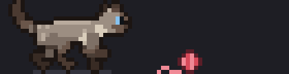

# cat-spinner

A pixel-art cat for the Claude Code spinner. While Claude works, the cat walks back and forth above the spinner line. When Claude starts thinking, it stops, looks at you, and sits down facing you with a thought bubble until the thinking is done, then gets up and walks on.

There are eight cats and four animations, and you can mix them freely.

## Cats


**Siamese** is the default. **White** has odd eyes, one blue and one amber, which you see when it sits facing you. **Calico** and **Tortoiseshell** have patched coats: the patches are fixed to the cat's body, so they move with it as it walks.

Here's the Siamese walking, sitting down to think, and walking on:



## Animations

**Walk** (the default): the cat walks back and forth, as above.

**Yarn:** the cat plays with a ball of yarn. It walks up to the ball, drops into a play-bow, and swats it with a front paw. The ball rolls away spinning, trailing a loose strand, and the cat chases it. Now and then it scoops the ball back under itself and has to turn around to follow it. When Claude thinks, the cat sits down facing you and the ball stays where it stopped.



**Pounce:** the yarn game, but unpredictable. Each swat hits with a random strength and sometimes scoops the ball backward. Now and then the cat stops low to watch the ball roll, or stalks a ball that has nearly stopped: it crouches, wiggles its rear, and leaps onto it.



**Random:** a different one of walk, yarn, and pounce each time Claude starts working. The cat carries on from wherever it is.

## Reactions

Whatever the animation, the cat reacts to what Claude is doing with its tools:

- **Editing or writing files:** it sits facing you, typing on a little laptop.
- **Running a command:** it digs, front paws scrabbling, dirt flying back past its hind legs.
- **Reading or searching:** it sits and sweeps a magnifying glass across its face, its eye big under the lens.
- **A tool fails or is denied:** it jumps in surprise, back arched, tail puffed straight up, with a `!` over its head.

Each reaction lasts at least a second or so, so quick reads still show. Other tools leave the animation running.

> **Still in progress.** This is an early version and changes are still coming, so expect the cat to keep evolving.

## Requirements

- Claude Code with mods (function-hook plugins). It was built and tested on Claude Code 2.1.287.
- The terminal. In the desktop app and other surfaces you keep the normal spinner, because the pixel grid the cat is drawn with exists only in the terminal.
- A terminal with 24-bit color for accurate colors: Ghostty, iTerm2, kitty, WezTerm, and most modern terminals have it. The macOS Terminal app may show the colors less accurately.

## Install

In Claude Code, run these two commands:

```
/plugin marketplace add swicken/cat-spinner
/plugin install cat-spinner@cat-spinner
```

Or from a shell:

```sh
claude plugin marketplace add swicken/cat-spinner
claude plugin install cat-spinner@cat-spinner
```

Then start a new Claude Code session. The cat appears the next time Claude is working on something.

The install may say userConfig options are not yet set. Those are the choices of cat and animation, and it's fine to leave them: you get the walking Siamese, and you can switch any time (below).

## Choosing your cat and animation

Run `/cat-spinner` to open its settings: a live preview of your cat above a list of settings, **Cat** and **Animation**, each showing its current choice. Move with the arrow keys and press Enter on a setting to see its options, then Enter again to pick one. Changes save as you pick them, and the preview updates to match. In a setting's options Esc goes back to the list; in the list, Esc or **Done** closes.

There are shortcuts too, if you know what you want:

```
/cat-spinner calico      # or siamese, orange, tuxedo, black, russian-blue, white, tortoiseshell
/cat-spinner pounce      # or walk, yarn, random
```

The same choices are the **Cat** and **Animation** rows for cat-spinner in `/config`.

## Update and uninstall

To get the latest version:

```sh
claude plugin marketplace update cat-spinner
claude plugin update cat-spinner@cat-spinner
```

To remove it:

```sh
claude plugin uninstall cat-spinner@cat-spinner
claude plugin marketplace remove cat-spinner
```

## How it works

The mod hooks the spinner's drawing and puts a 9-row pixel grid above the normal spinner line, so the word, elapsed time, and token count are still there. Each terminal cell shows two stacked pixels using a half-block character with separate foreground and background colors. While a turn runs, a timer repaints the grid about 11 times a second, and the timer stops when the turn ends.

- **The walk** comes from a small skeleton rig (`hooks/rig.ts`). The legs move in a cat's walking order, so two or three paws are always on the ground. A planted paw stays on one spot of the ground while the body passes over it. The spine rocks slightly with each step, and the tail moves in a slow wave.
- **The yarn play** (`hooks/yarn.ts`) is a small set of rules run each frame: the ball rolls with friction and bounces off the ends of the track; the cat faces the ball, walks up to it or backs away from it, waits for it to slow, then swats it in a seven-frame play-bow. The cat's gait advances one frame per pixel it moves, forward or back, so its paws stay planted while it walks. Yarn plays out the same way every time; pounce adds random swat strength and scoops, pauses to watch, and a stalk that ends in a six-frame leap.
- **The reactions** (`hooks/react.ts`) come from a `tool.call` hook that notes which tool is running and whether it failed; each frame the cat starts, keeps, or drops an activity accordingly.
- **The sit** is hand-drawn pixel art, because at this size a front-facing cat reads better drawn pixel by pixel. While seated, the cat blinks slowly, flicks its tail tip, and thinks `hmm`, `...`, `?`, and `!`.
- **The colors** are a palette per coat (`COATS` in `hooks/rig.ts`): every shape uses a color role, such as coat, mask, muzzle, point, leg, or paw, so a new cat is a new palette. Patched coats also set two patch colors and a size, and their coat breaks into patches from smooth noise sampled in body coordinates. The Siamese is a seal-point colorpoint based on a real cat.

## Development

The plugin is the repository root: `.claude-plugin/plugin.json`, the hooks module in `hooks/`, and tests in `tests/`.

```sh
claude plugin validate .        # check the manifest and hooks the way Claude Code loads them
claude plugin test .            # run the tests, including the golden scenes
claude --plugin-dir .           # try your local copy in a session
npx tsx scripts/preview.ts      # regenerate the GIFs in assets/ (needs ffmpeg)
npx tsx scripts/fingerprints.ts > tests/golden.ts   # after an intended visual change
```

## License

MIT
